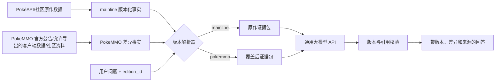

# 双版本架构与任务计划

更新日期：2026-09-09

## 1. 架构决策

项目只维护一套代码和一套规范化实体，不创建两个长期分叉的项目目录。发布时通过 `edition_id` 选择不同的事实解析方式：

- `mainline`：产品展示名“官方版（原作全世代）”。查询主系列游戏的基础事实，并要求带世代/游戏上下文。
- `pokemmo`：产品展示名“PokeMMO 特别版”。先查 PokeMMO 覆盖层，再按字段继承策略决定是否引用 `mainline` 基线。

之所以内部不用 `official` 作为标识，是为了避免把 PokéAPI、百科等社区来源误表述成官方数据。版本名与来源等级是两个独立概念。



## 2. 基础版与覆盖层的关系

PokeMMO 记录不能复制一整份原作宝可梦 JSON。它只保存差异、兼容性声明及其证据：

| 覆盖状态 | 含义 | 特别版行为 |
|---|---|---|
| `override` | PokeMMO 值与原作不同 | 使用 PokeMMO 值，并可并列展示原作值 |
| `same_as_base` | 已核验与指定原作基线一致 | 使用基线值，注明核验来源和时间 |
| `absent` | 原作内容在 PokeMMO 不存在/不可用 | 明确回答不可用，不回退 |
| `not_applicable` | 该字段对 PokeMMO 无意义 | 返回不适用 |
| `unknown` | 尚未取得可靠证据 | 明确资料不足，不用原作冒充 |

覆盖记录遵循 [overlay.schema.json](../schemas/overlay.schema.json)，并指向被覆盖的 `base_fact_id`。原作更新后，若基线事实发生变化，关联的 `same_as_base` 声明自动失效并进入复核队列。

### 字段继承策略

| 策略 | 典型字段 | 行为 |
|---|---|---|
| 可自动继承 | 全国图鉴编号、规范中英日名称、物种关系等身份字段 | 没有覆盖时引用原作基线，并标注“原作基线” |
| 必须显式核验 | 属性、种族值、特性、招式参数、学习面、进化、蛋组、捕获率、培育规则 | 必须存在 `override` 或 `same_as_base`；否则为 `unknown` |
| 禁止继承 | PokeMMO 遭遇地点/概率、香水、群怪、Alpha、经济、商店、PvP 分级、活动规则 | 只能来自 PokeMMO 域证据 |

这个策略应由数据表/配置驱动，不写死在提示词里。

## 3. 共同基础任务

以下任务只做一次，同时服务两个版本。

| ID | 优先级 | 任务 | 产物与验收 | 依赖 | 估算 |
|---|---:|---|---|---|---:|
| S01 | P0 | 明确产品域与术语 | `mainline`/`pokemmo`/来源等级/版本默认规则形成 ADR | 无 | 1 人日 |
| S02 | P0 | 建立来源与合规注册表 | 每个来源有用途、许可证、允许采集方式、更新策略和禁用项 | S01 | 1–2 人日 |
| S03 | P0 | 定义稳定实体 ID | 物种、形态、招式、特性、道具和版本均不依赖中文名连接 | S01 | 2 人日 |
| S04 | P0 | 建立版本化事实 Schema | `fact`、`source_snapshot`、`alias`、`edition`、`overlay` 可验证 | S02–S03 | 2–3 人日 |
| S05 | P0 | 项目骨架与配置 | 独立 CLI/API、`.env.example`、供应商适配器；默认不开启付费 API | S04 | 2 人日 |
| S06 | P0 | 数据流水线框架 | sync → raw → staged → curated → audit 可重复、幂等、固定 commit | S04–S05 | 3 人日 |
| S07 | P0 | 查询与证据包契约 | 实体链接、版本槽位、SQL/FTS 路由与结构化证据包 | S04 | 3 人日 |
| S08 | P1 | LLM 约束与本地回退 | 无证据不调用；引用校验；API 失败返回本地检索结果 | S07 | 2–3 人日 |
| S09 | P1 | 费用和调用限制 | token、估算费用、并发预留、每日上限、超时重试均可测试 | S05、S08 | 2 人日 |
| S10 | P0 | 评测框架 | 测试不访问真实付费 API；按 edition 分组生成报告 | S07 | 2 人日 |

## 4. 官方版（原作全世代）任务

官方版先发布，是 PokeMMO 特别版的不可变语义基线。

### O1：20 只宝可梦试点

| ID | 优先级 | 任务 | 产物与验收 | 依赖 | 估算 |
|---|---:|---|---|---|---:|
| O01 | P0 | 固定 PokéAPI 快照 | 记录 commit、SHA-256、许可证与获取日期 | S02、S06 | 1 人日 |
| O02 | P0 | 导入核心字典 | language、generation、game、version-group、type、stat | O01 | 1–2 人日 |
| O03 | P0 | 导入试点实体 | 20 只覆盖单形态、多形态、地区形态、分支/特殊进化、无性别、纯母种族、图图犬 | O02 | 2–3 人日 |
| O04 | P0 | 导入关系事实 | 种族值、特性、进化、学习面、蛋组与少量道具 | O03 | 3–4 人日 |
| O05 | P0 | 中文名称与消歧 | `zh-Hans`/`zh-Hant`/英文/编号/常用别名；歧义时列候选 | O03 | 2 人日 |
| O06 | P0 | 数据质量报告 | 外键、形态、版本覆盖率、中文字段覆盖率和冲突报告 | O04–O05 | 2 人日 |
| O07 | P0 | 试点查询与测试 | 50 条无 LLM 精确查询全部返回事实、适用版本和来源 | O04–O06、S10 | 2–3 人日 |

### O2：全量结构化数据

| ID | 优先级 | 任务 | 产物与验收 | 依赖 | 估算 |
|---|---:|---|---|---|---:|
| O08 | P0 | 扩展至全量物种/形态 | 上游范围内全量导入；数量与引用完整性可审计 | O07 | 3–5 人日 |
| O09 | P0 | 全量招式/特性/进化/学习面 | 按版本组保留历史，不以最新值覆盖旧值 | O08 | 4–6 人日 |
| O10 | P1 | 道具与地点第二批 | 只导入已定义范围；未知/缺失不推断 | O09 | 3–5 人日 |
| O11 | P1 | 百科文本层 | 合规文本/人工摘要切片，带实体和版本标签；不保存无必要整页 | O08 | 3–4 人日 |
| O12 | P1 | 混合检索 | SQL 优先、FTS 其次；向量检索必须通过对照评测后启用 | O11、S07 | 3–4 人日 |

### O3：官方版发布门禁

| ID | 优先级 | 任务 | 产物与验收 | 依赖 | 估算 |
|---|---:|---|---|---|---:|
| O13 | P0 | 300 题黄金集 | 覆盖事实、版本、形态、别名、多跳、拒答与提示注入 | O09、S10 | 3–4 人日 |
| O14 | P0 | API/CLI 端到端验收 | 本地模式和模型模式都能返回版本、答案与来源 | O12–O13、S08 | 2–3 人日 |
| O15 | P0 | 更新演练 | 新上游快照产生 diff；异常变化不会自动发布 | O14 | 2 人日 |
| O16 | P0 | `mainline-v1` 发布 | 无 PokeMMO 数据泄漏；核心指标达到项目设定阈值 | O15 | 1 人日 |

官方版最小发布标准：结构化事实精确率 ≥ 99%，版本正确率 ≥ 98%，有事实结论的答案引用支持率 100%，无证据问题拒答率 ≥ 95%。这些是项目目标，不代表模型供应商承诺。

## 5. PokeMMO 特别版任务

特别版在 `mainline-v1` 数据契约稳定后开始；前期可以并行做只读来源审计，但不能提前复制一套数据库。

### P1：来源与覆盖框架

| ID | 优先级 | 任务 | 产物与验收 | 依赖 | 估算 |
|---|---:|---|---|---|---:|
| P01 | P0 | PokeMMO 来源审计 | 官方论坛/更新公告、客户端允许导出内容、lzpoke、Alphapedia、GitHub 数据集逐项记录许可和可信等级 | S02 | 2–3 人日 |
| P02 | P0 | 覆盖层数据库 | 实现五种覆盖状态、有效时间、证据与 `base_fact_id` | S04 | 2–3 人日 |
| P03 | P0 | 字段继承策略表 | 每个 predicate 属于自动、显式核验或禁止继承；测试无越权回退 | P02 | 2 人日 |
| P04 | P0 | 基线变更失效机制 | 原作事实变化时，对应 PokeMMO 兼容性声明进入复核队列 | P02–P03、O15 | 2 人日 |

### P2：20 只宝可梦差异试点

| ID | 优先级 | 任务 | 产物与验收 | 依赖 | 估算 |
|---|---:|---|---|---|---:|
| P05 | P0 | 选择差异样本 | 与官方版 20 只尽量重合，并覆盖捕获率、特性、学习面、遗传、进化、遭遇和不可获得 | O07、P01 | 1 人日 |
| P06 | P0 | 采集可核验静态差异 | 每条记录具有覆盖状态、有效时间、来源、原作基线与审核人 | P03、P05 | 3–5 人日 |
| P07 | P0 | 差异解析器 | 将允许导出的结构化数据/人工公告转为 overlay；不采集 ToS 禁止的数据 | P01–P03 | 3–4 人日 |
| P08 | P0 | 特别版答案解析 | 回答中区分“PokeMMO 值、原作值、已核验相同、未知” | P06–P07、S08 | 2–3 人日 |
| P09 | P0 | 差异试点评测 | 至少 100 题，验证原作不能覆盖 MMO 差异、未知不能自动继承 | P08、S10 | 2–3 人日 |

### P3：扩大 PokeMMO 静态覆盖

| ID | 优先级 | 任务 | 产物与验收 | 依赖 | 估算 |
|---|---:|---|---|---|---:|
| P10 | P0 | 当前可用宝可梦目录 | 可获得/不可获得、地区和形态范围有来源与快照时间 | P09 | 3–5 人日 |
| P11 | P0 | 战斗差异 | 属性、种族值、特性、招式参数、学习面与 PvP 规则差异 | P10 | 5–8 人日 |
| P12 | P0 | 培育与进化差异 | 蛋组、遗传链、纯母/无性别限制、图图犬链路、进化条件 | P10 | 5–8 人日 |
| P13 | P1 | 遭遇与地点 | 地区、路线、方式、香水、群怪、时间/季节；只保存稳定资料 | P10 | 5–8 人日 |
| P14 | P1 | 道具与固定获取 | 效果、商店/固定获取、非实时价格；带有效时间 | P10 | 3–5 人日 |
| P15 | P1 | PokeMMO 机制文档 | Alpha 等长期机制的人工摘要与官方更新引用 | P01、P10 | 3–4 人日 |
| P16 | P1 | 遗传最短路径算法 | 合法性约束、路径证据与反例测试，不让 LLM 自行规划链路 | P12 | 4–6 人日 |

### P4：特别版发布门禁

| ID | 优先级 | 任务 | 产物与验收 | 依赖 | 估算 |
|---|---:|---|---|---|---:|
| P17 | P0 | 双版本对照集 | 同一问题在两个 edition 下产生可解释差异 | P11–P16 | 3 人日 |
| P18 | P0 | 覆盖率与未知报告 | 按 predicate 输出 `override/same/unknown/absent` 数量 | P17 | 1–2 人日 |
| P19 | P0 | 更新公告回放 | 用历史公告测试覆盖生效、失效与回滚，不修改基线事实 | P04、P17 | 2–3 人日 |
| P20 | P0 | `pokemmo-v1` 发布 | 特别版不含实时市场/头目/明雷；无证据差异不会引用原作冒充 | P18–P19 | 1 人日 |

## 6. 两个版本的接口

推荐同一个 API，通过显式参数选择版本：

```text
POST /v1/ask                 edition_id=mainline|pokemmo
GET  /v1/facts/query         edition_id=...
GET  /v1/entities/search     domain=...&edition_id=...
GET  /v1/compare             base=mainline&target=pokemmo
GET  /v1/coverage            edition_id=...
```

客户端可以分别包装成“官方版”和“PokeMMO 特别版”，但服务端禁止根据问题中偶然出现的词静默切换 edition。用户明确问版本对比时才同时查询两套证据。

## 7. PokeMMO 静态与动态边界

特别版静态知识库包含长期可复用事实：精灵、招式、特性、培育、进化、固定遭遇、机制差异和有生效时间的更新公告。

以下内容不进入永久事实表：当前头目、明雷、奇遇、市场价格、短期活动和即时刷新信息。未来如果需要，应实现独立的 live adapter，响应中包含 `observed_at`、数据新鲜度和失败状态；实时查询失败不能回退到旧静态值。

## 8. 推荐执行顺序

```text
共同基础 S01–S10
    ↓
官方版试点 O01–O07
    ↓
官方版全量与发布 O08–O16
    ↓
PokeMMO 覆盖框架 P01–P04
    ↓
PokeMMO 试点 P05–P09
    ↓
PokeMMO 扩面与发布 P10–P20
```

`P01` 来源审计可在官方版开发期间提前进行；其余 PokeMMO 任务最好等待稳定的实体 ID、事实 Schema 和 `mainline-v1` 基线。

## 9. 首批试点实体选择建议

不只按人气选取，应覆盖数据模型边界：

- 普通三段进化：妙蛙种子家族
- 分支/特殊进化：伊布家族、无畏小子家族
- 地区形态：六尾、喵喵或雷丘
- 多形态：洛托姆
- 无性别：小磁怪或铁哑铃
- 纯母种族：尼多兰家族或吉利蛋家族
- 遗传特例：图图犬
- 版本机制变化：耿鬼等存在历史特性变化的物种
- PokeMMO 已确认差异样本：从旧项目资料中选取皮卡丘，并在来源审计后补足其他样本

最终名单必须以可取得的 PokeMMO 证据为准，不为了凑类型而制造无来源差异。

## 10. 双版本验收原则

- 相同实体 ID 在两个版本间可稳定对照。
- 官方版查询永远不会读取 PokeMMO overlay。
- 特别版的差异敏感字段没有核验状态时返回未知。
- `same_as_base` 也必须有 PokeMMO 证据，且与具体基线快照绑定。
- 每个差异答案至少能追溯到一条 PokeMMO 来源和一条被比较的原作来源。
- 更新 PokeAPI 只产生基线 diff，不直接重写 overlay。
- 所有测试可在关闭大模型 API 和无网络的情况下完成。

