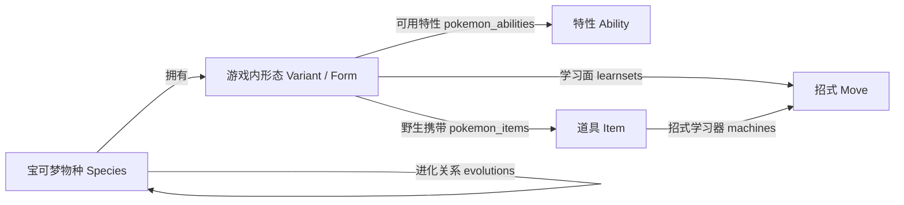

# 知识实体与关系模型

## 设计结论

宝可梦、形态、招式、特性和道具不采用“整只宝可梦一个大 JSON”的从属结构。它们是可独立命名、检索、引用和版本化的一等实体；学习面、可用特性、野生携带物等信息作为关系记录保存。

这样做有三个直接收益：查询“静电是什么”时无需先找到皮卡丘；查询“哪些宝可梦能学冲浪”时可以反向遍历学习面；PokeMMO 版可以只覆盖某条关系或某个实体属性，而不复制整份宝可梦记录。

## 四个层次

1. **实体注册层**：`entities` 统一登记实体类型、稳定 ID、标识符、详情是否就绪和来源；`entity_aliases` 统一保存中文名、英文名、slug、编号等检索入口。
2. **领域事实层**：`species`、`moves`、`abilities`、`items` 各自保存本领域属性，名称和效果文本放在各自的多语言表中。
3. **关系层**：`pokemon_abilities`、`learnsets`、`pokemon_items`、`machines`、`evolutions` 连接实体，并携带版本、获得方式、等级、概率等关系自身的属性。
4. **版本覆盖层**：官方版读取主系列基线；PokeMMO 特别版对实体字段或关系记录应用覆盖，未覆盖部分继续继承官方版。

## 顶层精确机制

游戏内 `flavor_text` 主要用于自然语言展示，经常只写“更容易捕捉”或“威力提高”。捕获倍率、伤害倍率、触发概率和HP消耗另外保存在 `mechanic_summaries` 中，不与描述文本混为一谈。

- 用户未指定版本时，默认读取第九世代标准主系列规则，当前规则锚点为 `scarlet-violet`。
- 一条机制记录同时保存世代、版本组、中文摘要、机器可读参数 JSON、来源定位和核验说明。
- 后续加入旧世代记录后，按用户指定版本精确选择；不能把旧值覆盖到第九世代记录上。
- 特殊作品采用不同捕获规则时，应建立单独作品域，不能沿用标准主系列精灵球倍率。

## 当前落地范围

| 对象 | 当前数据范围 | 是否可独立检索 |
|---|---:|---|
| 宝可梦名称目录 | 1,025 个物种 | 是；20 个试点物种有完整详情 |
| 特性 | 374 条 | 是 |
| 招式 | 937 条 | 是 |
| 道具 | 2,223 条 | 是 |
| 试点学习面 | 25,404 条关系 | 可按宝可梦、招式、版本交叉查询 |
| 试点野生携带物 | 137 条关系 | 已入库，问答意图待继续扩充 |
| 第九世代精确机制摘要 | 66 条 | 精灵球、常用倍率道具和倍率型特性 |

这里的“独立”不等于“互相隔离”。例如宝可梦详情可以显示特性名称，但特性效果只维护在 `abilities` / `ability_prose` 中；详情中的特性只是到该实体的关系引用。

## 后续扩展原则

- 属性、蛋组、招式分类、道具类别也可以在需要反向查询时提升为统一实体，目前先作为规范化字典表。
- 形态必须与物种分开保存。当前试点已拆为 `pokemon_variants` 和 `pokemon_forms`，后续再将形态别名加入统一实体检索。
- 所有会随游戏变化的事实都应把版本放在关系或有效期上，不能覆盖成一个“最新值”。
- PokeMMO 差异应记录为覆盖来源、适用版本和核验时间，不能直接改写主系列基线。
